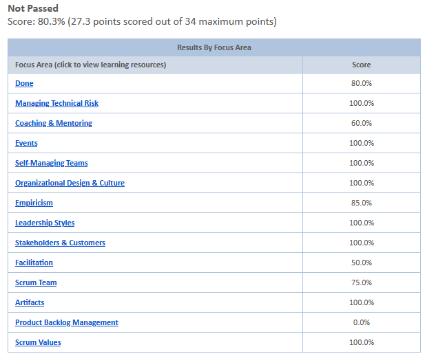

# PROFESSIONAL SCRUM MASTER™ II 受験記

https://www.scrum.org/professional-scrum-master-ii-certification

## 結果
不合格
- 受験日時: 2022/05/22 13:30-15:00
- 受験回数: 1回目
- 得点: 27.3/34(80.3%)
  - 合格85%以上

## どんな試験？
[スクラム](https://scrumguides.org/docs/scrumguide/v2020/2020-Scrum-Guide-Japanese.pdf)の役割の一つであるスクラムマスターの能力を認定。  
このあたりを見るとわかりやすいかも。  
[スクラムマスターにおすすめの資格は3つだけ【コスパ良し】](https://proengineer.internous.co.jp/content/columnfeature/17096)  
[スクラムマスター資格psmに合格した私の勉強法](https://shiftasia.com/ja/column/%E3%82%B9%E3%82%AF%E3%83%A9%E3%83%A0%E3%83%9E%E3%82%B9%E3%82%BF%E3%83%BC%E8%B3%87%E6%A0%BCpsm%E3%81%AB%E5%90%88%E6%A0%BC%E3%81%97%E3%81%9F%E7%A7%81%E3%81%AE%E5%8B%89%E5%BC%B7%E6%B3%95/)

## 受験のきっかけ
日頃開発チームの一員としてスクラム開発に携わっているため実力試し。

## 事前勉強
日頃携わっているスクラム開発がそのまま試験勉強。  
私は開発チームの一員であるが現在スクラムマスター不在につき、  
スクラムマスターとしての視点も併せ持つつもり  
なお自分のスクラムのバイブルは以下。  
- [SCRUM BOOT CAMP THE BOOK](https://www.amazon.co.jp/SCRUM-BOOT-CAMP-BOOK-%E8%A5%BF%E6%9D%91/dp/4798129712)  
- [https://www.ryuzee.com/](https://www.ryuzee.com/)

## 感想
- 日頃の知識をそのまま試してこそと思ったが無謀だったか
- 状況を説明する文章を読んでどのように対応するかの問題がほとんど
  - I だと短文の問題でその分問題数が多いらしい
- 全くわからない問題はなかったが曖昧で判断に悩む問題がいくつかあった
  - そういう問題を落としてしまったのだろうか
  - エリア毎の正解率は受け取ったが問題が手元にないので生かそうにも。。。 
- 80%超なら大抵の試験は合格なのに。。。
- Webカメラで監視されるわけでもないのでいろいろやりたい放題なのでは？
  - やりませんけど
- 全て英語だが翻訳アドオン使っていいので困ることはない
- 受験料が$250！
  - 日本円で3万円超？
  - 不合格だと自腹なので2回目は金銭面的につらい
- スクラムの知識が不十分であることがわかったので主催であるScrum.orgの資料を読む等して研鑽に励むことにする

